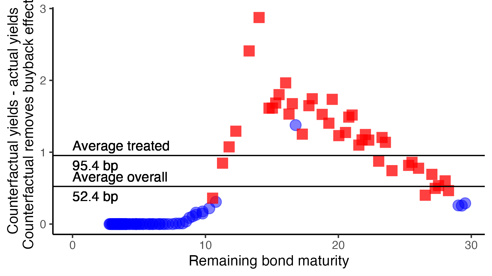

---

##### Download:

- [Working paper version](../../static/trasury_buybacks_final_ref.pdf)

---

##### Abstract:

We document spillover effects of the 2000-2002 Treasury Buyback program on Treasury
returns and the composition of the Federal Reserve’s System Open Market Account
(SOMA) portfolio. The reduction in bond supply due to the buybacks contributed
an average of 95 basis points to the yields of bonds bought back and bonds
of similar maturity over the course of the program. Each $10 billion of purchases corresponded
with an average yield increase of 7.8 basis points. At a higher frequency,
prices of purchased and near substitute bonds increased on settlement dates. Changes
to the SOMA portfolio were smaller for securities exposed to the buybacks and tended
to occur outside of auction weeks, consistent with the Federal Reserve attempting to
avoid exacerbating Treasury supply shortages. We relate our findings to the theoretical
literature on asset supply in preferred habitats models of the term structure. Our
results suggest that the proposed reintroduction of the Treasury buyback program will
have limited effects due to its size and proposed composition.
---


##### Citation

Michael F. Connolly, Ethan Struby. 2024. "Treasury buybacks, the Federal Reserve’s portfolio, and changes in local supply." *Journal of Banking and Finance* Volume 198 (Issue C). 10.1016/j.jbankfin.2024.107286

```BibTeX
@article{CS_buybacks,
title = {Treasury buybacks, the Federal Reserve’s portfolio, and changes in local supply},
author = {Connolly, Michael F. and Struby, Ethan},
year = {2024},
journal = {Journal of Banking & Finance},
volume = {168},
number = {C},
pages = {S0378426624002000},
doi = 10.1016/j.jbankfin.2024.107286
```

---

