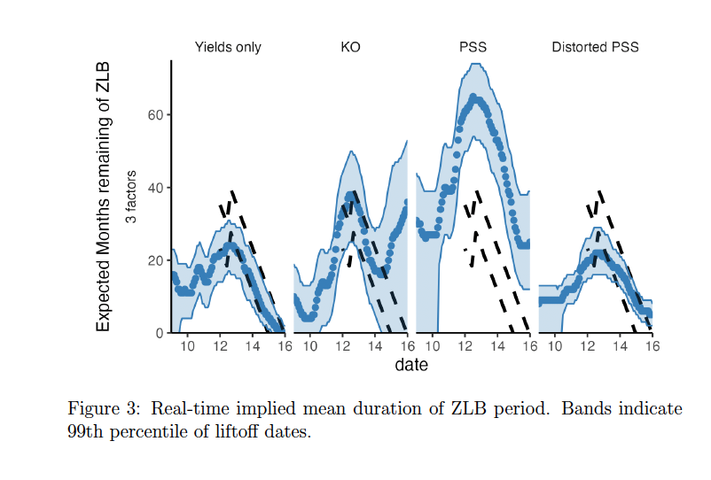

##### Download:

- [Working paper version](../../static/shadow_rate_jfec_revision.pdf)

---

##### Abstract:

We examine the channels and efficacy of monetary policy at the
zero lower bound (ZLB) through the lens of various shadow rate models.
Our key methodological contribution is to extend the discretization
filter to incorporate missing observations. This allows us to estimate
shadow rate models that both incorporate survey forecasts and
allow for departures from rational expectations. Although the models
disagree about the level of the shadow rate and the duration of the
ZLB in real time, they are consistent in attributing most of the effects
of major Federal Reserve policy announcements to changes in term
premia. We estimate small macroeconomic effects of shocks to the
shadow rate relative to prior estimates, but this is due to differences
in the sample, not the shadow rate estimation.

---


---


##### Citation

Ethan Struby & Michael F. Connolly, 2024. "Shadow Rate Models and Monetary Policy," Working Papers 2022-03, Carleton College, Department of Economics.

```BibTeX
@TechReport{CS_shadowrates,
title = {Shadow Rate Models and Monetary Policy},
author = {Connolly, Michael F. and Struby, Ethan},
year = {2024},
institution={Carleton College, Department of Economics},
type={Working Papers}
number={2022-03}

```

---

