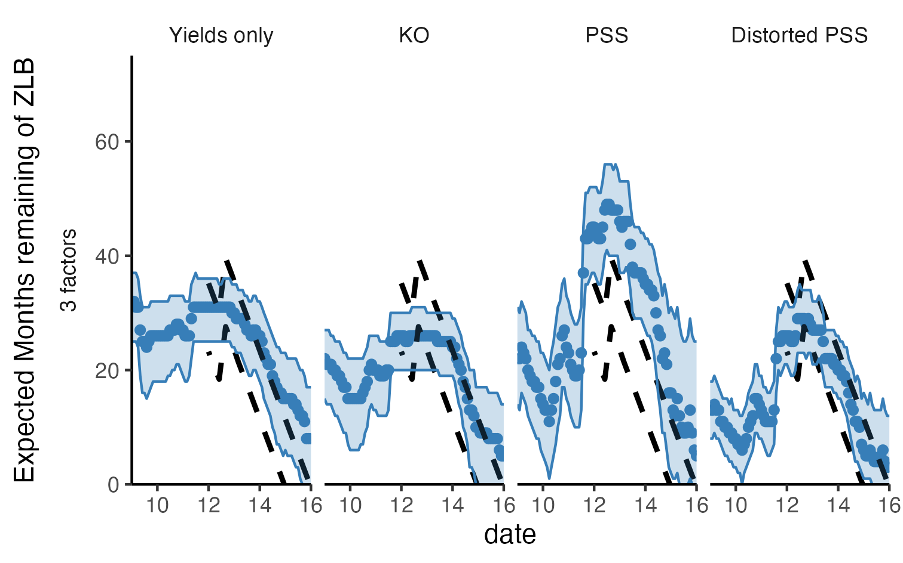

##### Download:

- [Working paper version](shadow_rate_jfec_R2_final.pdf)

---

##### Abstract:

We examine the channels and efficacy of monetary policy at the
zero lower bound (ZLB) through the lens of various shadow rate models.
Our key methodological contribution is to extend the discretization
filter to incorporate missing observations. This allows us to estimate
shadow rate models that both incorporate survey forecasts and
allow for departures from rational expectations. The models disagree
about the level of the shadow rate and the duration of the ZLB in real
time, but they are remarkably consistent in terms of their implications
for the effects and channels of policy across a number of structural
and reduced-form exercises. Particularly, they attribute most of the
effects of major Federal Reserve policy announcements to changes in
term premia, and imply that large scale asset purchases affected term
premia both by changes in average duration and changes in local supply
of substitute assets.

---


---


##### Citation

Ethan Struby & Michael F. Connolly, 2026. "Shadow Rate Models and Monetary Policy," Working Papers 2022-03, Carleton College, Department of Economics.

```BibTeX
@TechReport{CS_shadowrates,
title = {Shadow Rate Models and Monetary Policy},
author = {Connolly, Michael F. and Struby, Ethan},
year = {2026},
institution={Carleton College, Department of Economics},
type={Working Papers}
number={2022-03}

```

---

