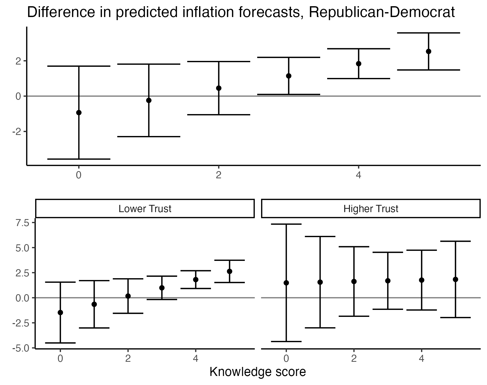

##### Download:

- [Working paper version](../../static/farhart_struby_CES.pdf)

---

##### Abstract:

Using a unique, nationally representative survey from the 2022 midterm elections, we investigate the partisan divide in beliefs about inflation. Party identity is predictive of inflation forecasts, as well as stated beliefs about recent inflation and the Federal Reserve's long-run inflation target. After conditioning on those two variables, the partisan gap in forecasts is about half of the unconditional average difference between Democrats and Republicans. We find that the difference in reported forecasts conditional on nowcasts and long-run beliefs is driven by respondents who have high levels of knowledge about politics and lower levels of (generalized) trust in others. Our findings are consistent with the literature in political psychology that examines the endorsement of conspiracy theories and political misinformation, and imply a sizable portion of the partisan divide in inflation forecasts is attributable to strategic responses to forecast surveys.
---


---


##### Citation

Michael F. Connolly, Ethan Struby. 2024. "Treasury buybacks, the Federal Reserve’s portfolio, and changes in local supply." *Journal of Banking and Finance* Volume 198 (Issue C). 10.1016/j.jbankfin.2024.107286

```BibTeX
@article{CS_buybacks,
title = {Treasury buybacks, the Federal Reserve’s portfolio, and changes in local supply},
author = {Connolly, Michael F. and Struby, Ethan},
year = {2024},
journal = {Journal of Banking & Finance},
volume = {168},
number = {C},
pages = {S0378426624002000},
doi = 10.1016/j.jbankfin.2024.107286
```

---

