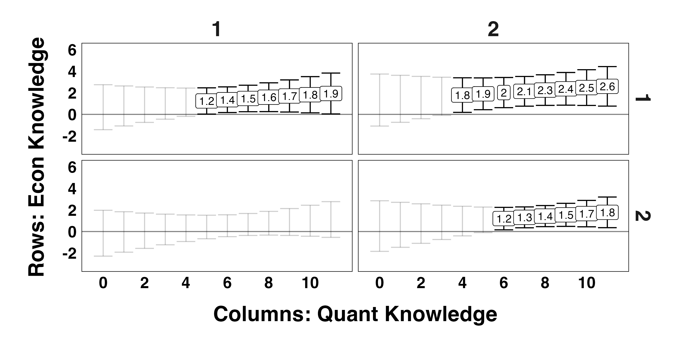

##### Download:

- [Working paper version](../../static/FS2_knowledgable_partisans.pdf)

---

##### Abstract:

Using a nationally representative survey from the 2024 United States presidential election, we investigate the role knowledge plays in the difference between inflation expectations of Republicans and Democrats.  Unconditionally, Republicans' average inflation forecast was nearly 3\% higher than Democrats; they also reported higher inflation in the past year (3.5\%) and higher expectations in the long run (2.0\%).  Conditioning on their beliefs about the future and their long-run forecasts reduces the pure partisan gap in inflation forecasts by two thirds. The gap between Democrats and Republicans is largest for partisans who are the most knowledgeable about politics. Greater numeracy appears to exacerbate the partisan gap, while greater economic knowledge mitigates it. The differential role of partisan and economic knowledge are consistent with a model where respondents' survey responses balance objective forecasts with affective motives.
---


---


##### Citation

Ethan Struby & Christina Farhart, 2025. "Knowledgeable Partisans and Inflation Expectations," Carleton College Working Paper.

```BibTeX
@TechReport{FS_2025,
  author={Ethan Struby and Christina Farhart},
  title={{Knowledgeable Partisans and Inflation Expectations}},
  year=2025,
  institution={Carleton College, Department of Economics},
  month=July,
  type={Working Papers}
```

---

